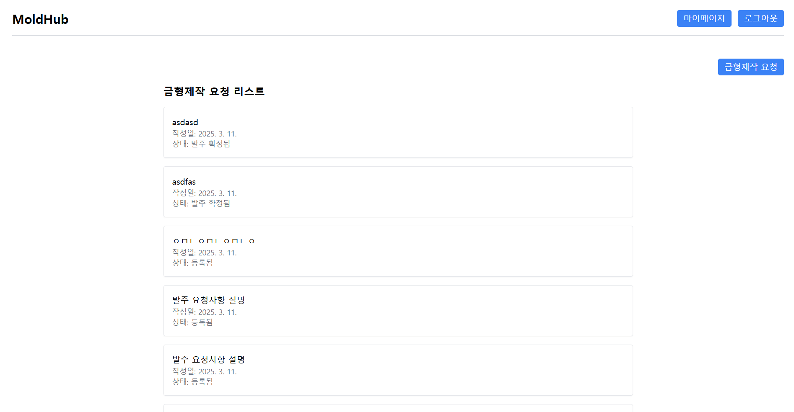
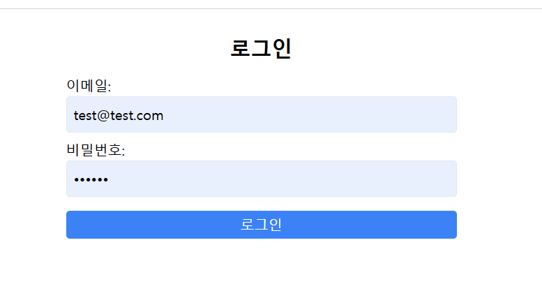
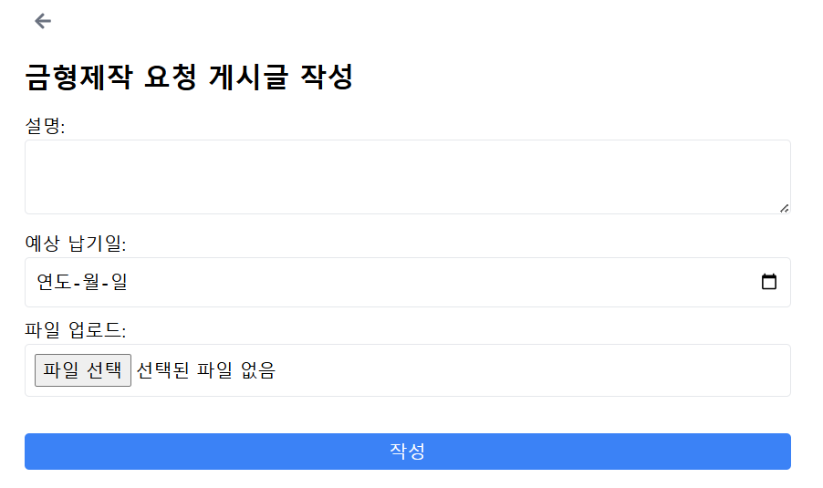
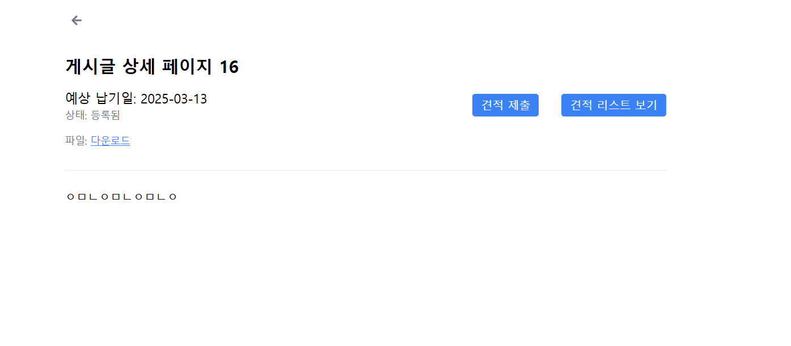
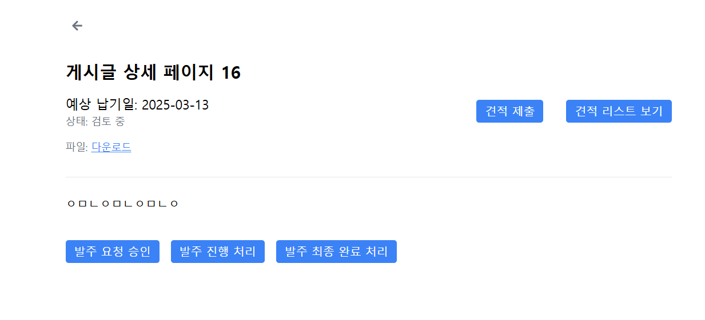
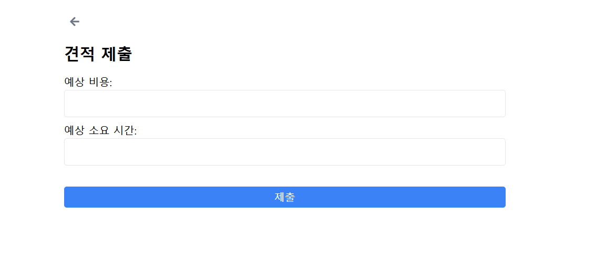
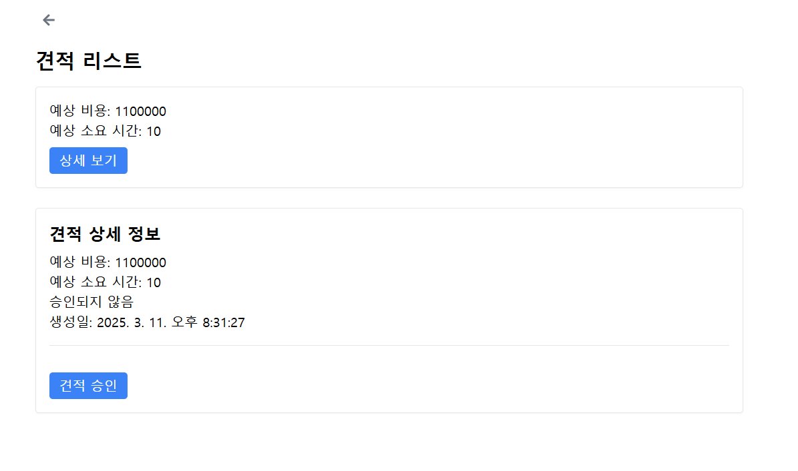
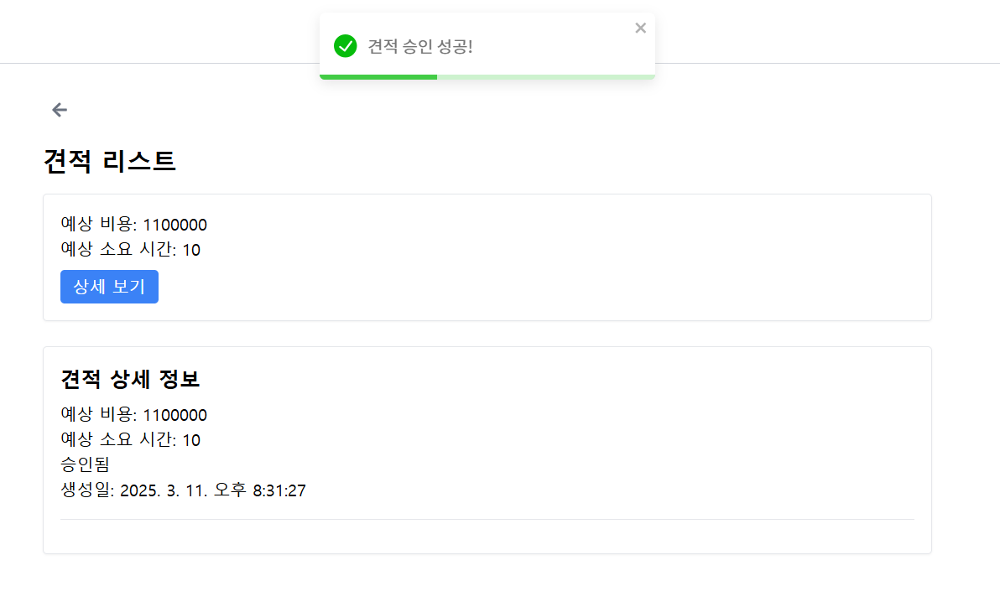
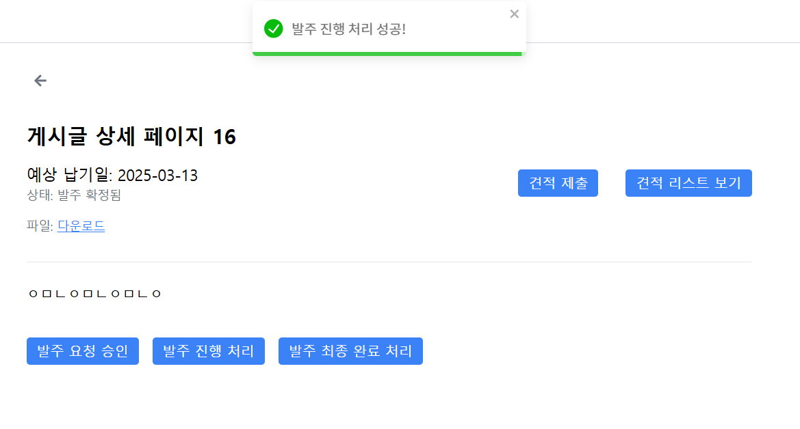

# **금형 제작 솔루션 프로젝트**

 

## **📌 프로젝트 개요**

본 프로젝트는 금형 제작 발주 및 견적 관리 프로세스를 효율적으로 운영하기 위한 솔루션입니다.  
발주사, 공급사, 관리자 간의 협업을 원활하게 진행할 수 있도록 기능을 제공합니다.

 

## **🛠 주요 기능 정리**

### **🔑 1. 로그인 및 회원가입**

 

- 사용자 계정 생성 및 로그인 기능 제공

---

### **📌 2. 발주 프로세스**

#### **1️⃣ 발주 요청 (상태: 등록됨)**

  
- 발주사는 금형 제작 요청 게시글을 작성할 수 있습니다.  
- 파일 업로드 기능을 통해 설계도를 첨부할 수 있습니다.  
- 작성된 게시글은 **"등록됨"** 상태로 저장됩니다.

#### **2️⃣ 관리자의 발주서 검토 (상태: 검토 중)**

  
- 관리자는 요청된 발주서를 조회할 수 있습니다.  
- 조회 시 발주서 상태가 **"검토 중"** 으로 변경됩니다.

#### **3️⃣ 관리자의 발주서 승인 (상태: 승인됨)**

  
- 관리자는 발주 요청을 승인할 수 있습니다.  
- 승인된 발주서는 **"승인됨"** 상태로 변경됩니다.

#### **4️⃣ 공급사의 견적 요청 (상태: 견적 요청됨)**

  
- 공급사는 승인된 발주서에 대해 견적을 제출할 수 있습니다.  
- 견적 제출 시 발주서 상태가 **"견적 요청됨"** 으로 변경됩니다.

#### **5️⃣ 발주사의 견적 조회 (상태: 견적 접수 중)**

  
- 발주사는 공급사가 제출한 견적을 확인할 수 있습니다.  
- 견적 조회 시 발주서 상태가 **"견적 접수 중"** 으로 변경됩니다.

#### **6️⃣ 발주사의 견적 승인 (상태: 발주 확정됨)**

  
- 발주사는 제출된 견적을 승인할 수 있습니다.  
- 승인 후 발주서 상태가 **"발주 확정됨"** 으로 변경됩니다.

#### **7️⃣ 관리자의 발주 진행 처리 (상태: 진행 중)**

  
- 관리자는 발주를 진행 처리할 수 있습니다.  
- 진행 처리 시 발주서 상태가 **"진행 중"** 으로 변경됩니다.

#### **8️⃣ 발주 완료 처리 (상태: 완료됨)**

- 발주사와 공급사가 모두 완료 처리를 해야 합니다.
- 두 측에서 완료 처리 시 발주서 상태가 **"완료됨"** 으로 변경됩니다.

 

## **🛠 사용 기술**

- **프론트엔드:** React-vite
- **백엔드:** Node.js (Express) - TypeScript
- **데이터베이스:** PostgreSQL
- **파일 스토리지:** AWS S3
- **인증 및 보안:** JWT (JSON Web Token)

 

## **📄 기타 사항**

- 초기 개발 속도를 우선시하여 **보안, 에러 핸들링, 상태 관리 부분에서 미흡한 점이 있을 수 있습니다.**  
  향후 개선이 필요함을 감안하여 검토 부탁드립니다.
