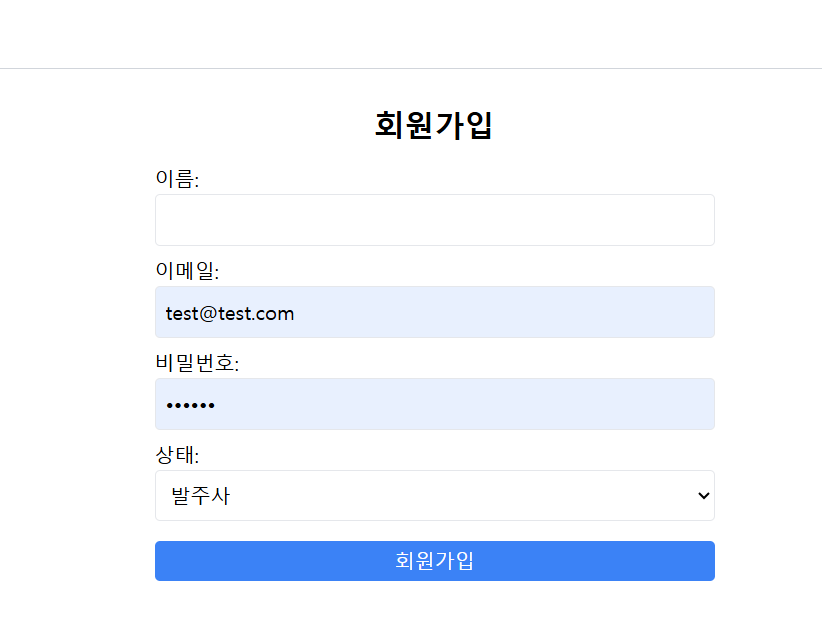

# 금형 제작 솔루션 PRJ

# 기능 정리

### 0. 로그인, 회원가입

### 1. 발주사가 발주 요청 (상태: 등록됨)

- 발주사는 금형 제작 요청 게시글을 작성할 수 있습니다.
- 파일 업로드 기능을 통해 설계도를 첨부할 수 있습니다.
- 작성된 게시글은 "등록됨" 상태로 저장됩니다.

### 2. 관리자가 요청된 발주서 조회 (상태: 검토중)

- 관리자는 요청된 발주서를 조회할 수 있습니다.
- 관리자가 발주서를 조회하면 상태가 "검토 중"으로 변경됩니다.

### 3. 관리자가 발주서 승인 (상태: 승인됨)

- 관리자는 발주서를 승인할 수 있습니다.
- 승인된 발주서는 "승인됨" 상태로 변경됩니다.

### 4. 공급사가 해당 발주에 견적 요청 (상태: 견적 요청됨)

- 공급사는 승인된 발주서에 대해 견적을 제출할 수 있습니다.
- 견적이 제출되면 발주서의 상태가 "견적 요청됨"으로 변경됩니다.

### 5. 발주사가 해당 견적 조회 (상태: 견적 접수중)

- 발주사는 제출된 견적을 조회할 수 있습니다.
- 발주사가 견적을 조회하면 발주서의 상태가 "견적 접수 중"으로 변경됩니다.

### 6. 발주사가 해당 견적 승인 (상태: 발주확정됨)

- 발주사는 제출된 견적을 승인할 수 있습니다.
- 견적이 승인되면 발주서의 상태가 "발주 확정됨"으로 변경됩니다.

### 7. 관리자가 발주 진행처리 (상태: 진행중)

- 관리자는 발주를 진행 처리할 수 있습니다.
- 발주가 진행 처리되면 발주서의 상태가 "진행 중"으로 변경됩니다.

### 8. 발주사, 공급사 모두 완료처리 (상태: 완료됨)

- 발주사와 공급사는 발주를 완료 처리할 수 있습니다.
- 발주사와 공급사가 모두 완료 처리하면 발주서의 상태가 "완료됨"으로 변경됩니다.
